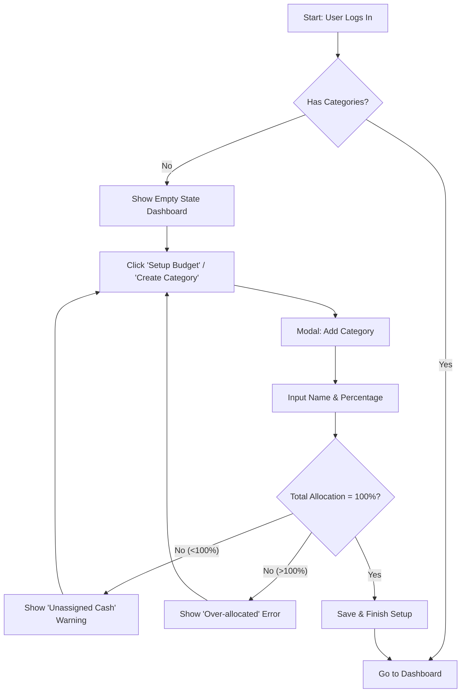
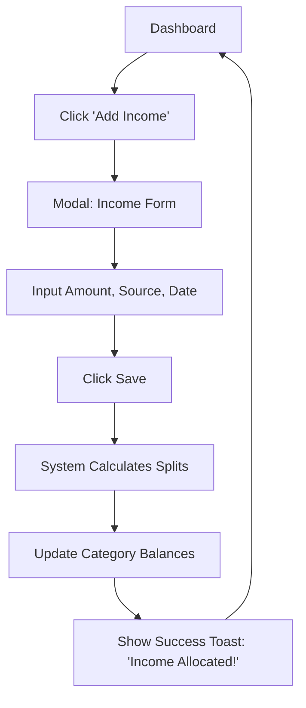
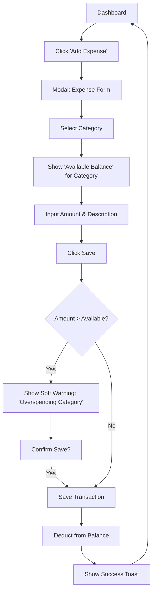

# UX Design Specification ExpensesTracker

**Author:** a
**Date:** 2025-12-03

---

## Executive Summary

### Project Vision

ExpensesTracker empowers individuals to take control of their finances through a flexible, user-defined envelope budgeting system. Unlike rigid tools, it combines the simplicity of manual entry with the intelligence of automatic percentage-based allocation. The goal is to provide "flexibility without complexity," giving users immediate visual clarity on their financial health and the freedom to organize their money exactly how they see fit.

### Target Users

*   **The "Control Seeker":** Someone who wants to manage their money actively but finds spreadsheets cumbersome and automated bank apps too generic. They value precision and custom categories (e.g., "Fun Money," "Project X Fund").
*   **The Visual Learner:** Users who need to *see* where their money is going through graphs and charts rather than just rows of numbers.
*   **The Mobile Tracker:** Users who want to quickly log an expense the moment it happens, requiring a fast, responsive mobile experience.

### Key Design Challenges

*   **Setup Friction:** Ensuring the initial category creation and percentage allocation (must equal 100%) is smooth, error-proof, and guided.
*   **Real-time Clarity:** delivering instant, clear feedback on balance updates after every transaction without visual clutter.
*   **Mobile Efficiency:** Designing complex data entry (income/expenses) and visualization views to be seamless and legible on small screens.

### Design Opportunities

*   **Visual Allocation:** Creating a delightful visual representation of income being automatically split into categories (the "envelope filling" moment).
*   **Frictionless Entry:** optimizing the manual transaction logging flow to be as fast as possible (smart defaults, quick actions) to encourage habit formation.
*   **Personalized Dashboard:** allowing users to feel ownership over their financial dashboard, reflecting their unique categorization strategy.

## Core User Experience

### Defining Experience

The core user experience of ExpensesTracker centers around providing **instant, transparent financial insight** with **minimal effort**. The most frequent and critical user interaction is **checking the dashboard**, which serves as the central hub for understanding one's financial status. The "aha!" moment for users is when they realize the power of **automated income allocation to categories** and the effortless management of **recurring expenses**, liberating them from manual calculations and constant vigilance.

### Platform Strategy

ExpensesTracker is a **web application designed for mobile optimization**, accessible across modern browsers. The interaction should be **responsive to both touch and mouse/keyboard inputs**, adapting seamlessly to various screen sizes. The focus is on a fluid, web-based experience, with a future-proof architecture that could support native mobile enhancements if needed, leveraging the existing web capabilities.

### Effortless Interactions

The following interactions should feel completely natural and require zero thought from the user:
*   **Checking current expenses:** Quickly viewing individual expense entries.
*   **Monitoring category balances:** Instant access to how much money is available in each custom category.
*   **Reviewing recent activity:** Easily seeing the latest income and expense transactions without searching.
*   **Income allocation:** The system automatically distributing income upon entry.
*   **Recurring expense management:** Automated handling of regular payments.

### Critical Success Moments

The make-or-break moments for ExpensesTracker are:
*   **First Income Entry:** When a user logs income and sees it **perfectly and instantly split** across their defined categories.
*   **Visualization Insight:** When viewing the **pie charts for category distribution** or the **income vs. expenses graph**, the user gains a clear, actionable insight into their spending patterns or financial health without any cognitive load.
*   **Automated Reliability:** The system successfully handles a recurring expense or allocation without user intervention, confirming its trustworthiness and ability to save mental effort.

### Experience Principles

*   **Visual Clarity First:** The dashboard and all visualizations must be immediate, legible, and insightful, prioritizing visual understanding over raw data.
*   **Automated Intelligence:** Empower users by handling complex, repetitive financial tasks automatically, such as income allocation and recurring expense management.
*   **Effortless Visibility:** Provide surface-level access to critical financial information (balances, recent activity) without requiring deep navigation or complex calculations.
*   **Trust Through Accuracy:** Maintain absolute precision in all calculations and data representation to build and sustain user confidence in the system's reliability.

## Desired Emotional Response

### Primary Emotional Goals

Users should feel **Empowered and in Control** when using ExpensesTracker. This extends beyond merely tracking numbers to instilling a deep sense of ownership, where they proudly feel "This feels like *my* system." Ultimately, the product should make users feel **Secure about their money decisions**, fostering a calm and confident relationship with their finances.

### Emotional Journey Mapping

*   **Discovery ("First Wow"):** Users should experience a sense of **Relief and Clarity**, thinking, "WOW, now I don't have to be lost with my money." This initial impression sets the stage for a journey towards financial understanding.
*   **Core Experience (Ongoing Use):** During regular interaction (e.g., checking the dashboard), users should feel **Proud and Happy** about their financial management, acknowledging how much they spend and how effectively they're doing it.
*   **After Task Completion (Micro-Delight):** After logging an income or expense, the feedback should elicit a pleasant **Surprise and Validation**, such as, "Wow, I still have this amount of money!" reinforcing positive behavior.
*   **When Something Goes Wrong (Mitigated Panic):** The system should actively prevent the feeling of "Holly SHIT i have no MONEY" by providing early warnings, clear explanations, and actionable insights if finances are tight, transforming potential panic into a moment of informed decision-making and a path to regain control.
*   **Returning to Use (Sustained Security):** Users should consistently feel **Secure and Confident** in their money decisions, eager to return to a tool that reliably supports their financial well-being.

### Micro-Emotions

To achieve these primary goals, we will focus on cultivating:
*   **Confidence** (over Confusion) in understanding their financial state.
*   **Trust** (over Skepticism) in the accuracy and reliability of the data and automation.
*   **Delight** (over mere Satisfaction) through intuitive interactions and visual clarity.
*   **Accomplishment** (over Frustration) when managing their finances effectively.

### Design Implications

*   **Visual Clarity & Feedback:** To foster **Security and Pride**, dashboards and visualizations must be impeccably designed for immediate comprehension, using clear iconography, intuitive color coding, and responsive charts that update in real-time. This directly addresses the desire for "knowing how much they spend and how well."
*   **Guided Setup & Automation:** To achieve the "This feels like *my* system" and "no longer lost" emotions, the initial setup of categories and allocation percentages must be highly intuitive and forgiving. The automation of income distribution and recurring expenses needs to be frictionless and reliable, minimizing the user's cognitive load.
*   **Proactive Insights & Support:** To prevent the "Holly SHIT" moment, the system should offer gentle nudges, clear warnings, and educational content that empowers users to adjust their spending or allocations before reaching a critical state. Error messages should be empathetic and provide solutions, not just identify problems.
*   **Positive Reinforcement:** Implement micro-interactions and visual cues that celebrate successful budgeting, savings, or responsible spending (e.g., celebratory animations on income allocation, subtle visual rewards for staying within budget), driving **happiness and accomplishment**.

### Emotional Design Principles

1.  **Clarity Cultivates Calm:** Prioritize clear, concise, and accessible information to reduce anxiety and build confidence.
2.  **Automation Empowers Action:** Leverage intelligent automation to free users from tedious tasks, allowing them to focus on financial strategy.
3.  **Transparency Builds Trust:** Ensure all financial data and system actions are transparent and easily verifiable, fostering unwavering trust.
4.  **Feedback Fuels Confidence:** Provide immediate, positive, and constructive feedback for all user actions and financial states.

## UX Pattern Analysis & Inspiration

### Inspiring Products Analysis

**Primary Inspiration Source: Apple Ecosystem Design Language**
We are drawing inspiration from the high standards of "Apple-style" design—characterized by minimalism, fluidity, and intuitive clarity.
*   **Core Strength:** Reducing complexity through clean layouts and focusing entirely on the content (in our case, financial data).
*   **Key Aesthetic:** Soft rounded corners ("squircles"), generous whitespace, clear typography, and smooth, meaningful animations.
*   **Interaction Style:** Fluid transitions, modal sheets for quick tasks, and a feeling of "physics" in the interface.

### Transferable UX Patterns

**Visual & Layout Patterns:**
*   **The Card Metaphor:** Encapsulating distinct data sets (e.g., "Category Balance", "Recent Activity") in clean, rounded cards with soft shadows to create hierarchy and touch-friendly targets.
*   **Hero Data Display:** Presenting the most critical numbers (Total Balance, Safe-to-Spend) in large, bold typography at the top of the screen, similar to Apple Health or Stocks.
*   **Bottom Navigation:** Utilizing a standard, easily accessible bottom tab bar for core navigation (Dashboard, Transactions, Visualizations), ensuring thumb-friendly reach on mobile.

**Interaction Patterns:**
*   **Modal Sheets for Data Entry:** "Add Income" and "Add Expense" flows should appear as slide-up sheets (drawers) rather than full-page redirects. This maintains context, keeping the user "in" their dashboard while performing a task.
*   **Interactive Charts:** Graphs should allow for "scrubbing" (touch and drag) to reveal specific data points, offering deeper insight without cluttering the initial view.
*   **Immediate Visual Feedback:** Success states (e.g., saving a transaction) should be accompanied by subtle animations (checks, bounces) to confirm actions instantly and delightfully.

### Anti-Patterns to Avoid

*   **Data Density Overload:** Avoid "spreadsheet-style" dense tables with tiny text, which creates cognitive load and feels outdated.
*   **Buried Core Actions:** Critical actions like "Log Expense" must never be hidden behind hamburger menus or deep navigation structures.
*   **Jarring System Alerts:** Error handling should be contextual and gentle (soft inline warnings), avoiding aggressive system-style popups that cause anxiety.

### Design Inspiration Strategy

**What to Adopt:**
*   **Clean Minimalism:** Prioritize whitespace and remove non-essential decorative elements to let the financial data breathe.
*   **Consistent Iconography:** Use simple, recognizable stroke or filled icons that align with a modern system aesthetic.
*   **Fluidity:** Ensure that state changes (e.g., a progress bar filling up, a balance updating) are animated smoothly, not jerky.

**What to Adapt:**
*   **Category Visualization:** Adapt the "envelope" concept into a modern, Apple-like visual—perhaps using colorful progress bars or "rings" (like Apple Fitness) to show budget consumption, which is visually engaging and easy to parse.

## Design System Foundation

### 1.1 Design System Choice

The chosen design system approach for ExpensesTracker is **Tailwind CSS combined with a headless UI component library (e.g., shadcn/ui)**.

### Rationale for Selection

This choice is driven by several key factors aligning with our UX vision:
*   **"Apple-Inspired" Aesthetic:** Tailwind's utility-first nature, coupled with the unstyled, customizable components of a library like shadcn/ui, provides unparalleled flexibility to meticulously craft the clean, minimalist, and fluid design language we identified as our primary inspiration. It allows for the precise implementation of rounded corners, subtle shadows, and clear typography without fighting pre-defined styles.
*   **High Customization & Control:** This approach grants full control over every design detail, ensuring ExpensesTracker can achieve a unique visual identity that directly supports the desired emotional responses (empowered, secure, personal).
*   **Accelerated Development Workflow:** Despite offering extensive customization, Tailwind's comprehensive utility classes significantly streamline UI development. Headless components further boost efficiency by providing ready-to-use, accessible, and interactive elements that only need styling.
*   **Mobile-First Responsiveness:** Tailwind CSS is inherently designed for mobile-first development, ensuring that the web application will be fully responsive and optimized for touch interactions on smaller devices from the ground up, crucial for an effortless mobile experience.

### Implementation Approach

*   **Core Styling:** Tailwind CSS will be the sole framework for all styling, ensuring consistency and leveraging its vast ecosystem of utility classes.
*   **Component Foundation:** A headless UI component library (e.g., shadcn/ui, Radix UI) will provide a robust, accessible, and unstyled base for common UI elements like buttons, forms and dialogs. These components will then be styled extensively with Tailwind CSS.
*   **Theming Integration:** A custom `tailwind.config.js` will be established to define project-specific design tokens including color palettes, typography scales, spacing, and border-radius values, all aligned with the desired Apple-esque aesthetic.

### Customization Strategy

*   **Design Tokens:** Leverage Tailwind's configuration to establish a system of design tokens (custom CSS properties) for colors, typography, and spacing, ensuring a single source of truth for design decisions and facilitating easy global updates.
*   **Component Composition:** Focus on building complex UI elements by composing simpler, Tailwind-styled components. This promotes reusability, maintainability, and consistency across the application.
*   **Visual Uniqueness:** Carefully design custom component variants and interactions using Tailwind's flexibility to inject the unique personality of ExpensesTracker, reinforcing the "This feels like *my* system" emotion.

## 2. Core User Experience

### 2.1 Defining Experience

The defining experience of ExpensesTracker is **The Moment of Clarity**. It is the instant a user opens the application and sees exactly how much money is available in each of their custom categories ("envelopes"). Unlike a bank balance which is a single, often misleading number, this experience answers the critical question: *"Can I afford this right now?"* by showing the "Safe to Spend" balance for specific needs (e.g., Dining Out, Groceries) at a glance.

### 2.2 User Mental Model

*   **Current Problem:** Users currently rely on a generic bank balance that mixes rent money with fun money, leading to accidental overspending. Or they use spreadsheets that are mentally taxing to update and interpret.
*   **Desired Model:** Users want to treat their categories as individual "mini bank accounts." They expect the dashboard to act as the source of truth for their *spending power*, not just their net worth.
*   **Expectation:** "If the app says I have $50 for coffee, I have $50 for coffee." The mental model shifts from "How much money do I have total?" to "How much money do I have *for this*?"

### 2.3 Success Criteria

*   **Zero-Click Visibility:** The dashboard is the landing screen; no navigation is required to see category balances.
*   **Visual Hierarchy:** "Available Balance" is the dominant visual element. "Total Allocated" or "Spent" are secondary.
*   **Instant Cognitive Processing:** Users can interpret their financial health (Green/Good vs. Red/Low) within 3 seconds of opening the app.
*   **Trust:** The numbers must feel "live" and precise, reinforcing that the automated backend calculations are trustworthy.

### 2.4 Novel UX Patterns

*   **Apple-Style "Rings" or Progress Bars for Budgets:** Adopting the fitness ring or clear progress bar metaphor to visualize budget consumption. A full ring/bar might mean "Full Budget Available," while an emptying one creates urgency.
*   **"Safe-to-Spend" Hero Card:** A prominent aggregate display at the top that sums up only the discretionary categories (excluding fixed bills/savings), giving a true "Fun Money" total.

### 2.5 Experience Mechanics

**1. Initiation:**
*   User launches the web app or navigates to the root URL.

**2. Interaction:**
*   **Passive:** The user primarily scans the dashboard.
*   **Active:** Tapping a specific category card expands it (via modal/sheet) to show recent transactions for *just* that category, allowing for a quick audit.

**3. Visuals:**
*   **Hero Section:** Displays "Total Available" in large, bold typography.
*   **Category Grid/List:** Each category is a distinct card containing:
    *   Category Name & Icon.
    *   Large "Available Balance" (e.g., $150.00).
    *   Visual Indicator (Progress bar/Ring) color-coded by health (Green = Healthy, Yellow = Low, Red = Empty/Negative).

**4. Feedback:**
*   **Health Indicators:** Color changes provide immediate, passive feedback on financial status.
*   **Low Balance Warnings:** Subtle visual cues (e.g., a warning icon) appear on cards that are below a certain threshold (e.g., <10%).

## Visual Design Foundation

### Color System

**Palette Strategy: "Modern Trust"**
*   **Primary Brand Color:** **Indigo** (e.g., Tailwind `indigo-600`). chosen to evoke empowerment and modern financial control, distinguishing it from traditional, sterile banking blues.
*   **Backgrounds:**
    *   **App Background:** `zinc-50` (Soft, warm gray) to reduce eye strain and create depth.
    *   **Surface/Cards:** `white` (Pure white) to create clean, elevated containers for data.
*   **Functional Colors (Apple-style Vibrancy):**
    *   **Income/Healthy:** `emerald-500` (Clear, positive, energetic).
    *   **Expense/Critical:** `rose-500` (Urgent but not aggressive).
    *   **Warning/Low:** `amber-500` (Visible, standard cautionary tone).
*   **Text Colors:**
    *   **Primary Text:** `slate-900` (Deepest gray, high contrast).
    *   **Secondary Text:** `slate-500` (Subtle, used for labels/metadata).

### Typography System

**Typeface Pairings:**
*   **UI & Body Text:** **Inter**. The industry standard for clean, legible, neutral interface design. It disappears into the background, letting the content shine.
*   **Headings & Numbers:** **Manrope**. A modern, geometric sans-serif with excellent readability for digits—critical for a finance app where the numbers *are* the content.

**Hierarchy Strategy:**
*   **Hero Numbers:** Extra large, bold weights (e.g., `text-4xl font-bold`) for "Total Balance" to create immediate focus.
*   **Labels:** Uppercase, tracked-out, small text (e.g., `text-xs uppercase tracking-wider text-slate-500`) for clarity without visual noise.

### Spacing & Layout Foundation

**Spatial Rhythm:**
*   **Base Unit:** **4px**. All spacing, margins, and sizing will be multiples of 4 (8px, 16px, 24px, 32px).
*   **Layout Feel:** **Airy and Spacious**. Generous padding (e.g., `p-6` or `p-8` on desktop cards) to prevent "spreadsheet anxiety" and promote a feeling of calm control.

**Structural Elements:**
*   **Cards:** The primary UI container.
    *   **Rounding:** `rounded-2xl` or `rounded-3xl` (Heavy rounding) to mimic the "Apple/iOS" friendly aesthetic.
    *   **Shadows:** `shadow-sm` for resting states, `shadow-md` for hover/active states to create subtle depth.
*   **Grid:** A responsive grid system (1 column mobile, 2-3 columns desktop) that adapts the "Card" layout fluidly across devices.

### Accessibility Considerations

*   **Contrast:** All primary text and functional colors will pass WCAG AA standards against their backgrounds.
*   **Color Independence:** "Health" states (Green/Red rings) will be supported by icons or text labels so colorblind users can still perceive status (e.g., a checkmark for good, an exclamation point for low).
*   **Touch Targets:** All interactive elements (buttons, inputs, list items) will meet the minimum 44x44px touch target size for effortless mobile interaction.

## Design Direction Decision

### Design Directions Explored

We explored 6 distinct design direction variations to find the optimal visual and interactive approach for ExpensesTracker, considering layout, information hierarchy, interaction patterns, color application, density, spacing, and navigation.

### Chosen Direction

**Design Direction 3: The "Financial Feed"**

This direction integrates the "Moment of Clarity" dashboard with a live, chronological feed of financial activity.

### Design Rationale

The "Financial Feed" direction aligns perfectly with our core UX goals by:
*   **Balancing Clarity and Activity:** It immediately answers "Can I afford this?" with the hero balance, while simultaneously showing "Where did my money go?" through the integrated transaction feed.
*   **Dynamic Engagement:** The scrolling feed keeps users engaged with their financial journey, reinforcing a sense of control and real-time awareness.
*   **Effortless Visibility:** It makes checking recent expenses and overall category health seamless, fostering a sense of continuous awareness without needing to navigate to separate screens.
*   **Apple-Inspired Fluidity:** This approach lends itself well to the smooth transitions and contextual feedback we established in our "Apple-inspired" aesthetic.

### Implementation Approach

*   The dashboard will feature a prominent top section for aggregated balances (e.g., "Safe-to-Spend" and category summaries).
*   Below this, a continuously scrolling feed will display recent income and expense transactions, potentially with subtle visual cues linking them to categories.
*   Interaction will focus on swiping/scrolling the feed and tapping elements for details, maintaining the fluid, Apple-like interaction patterns.

## User Journey Flows

### Onboarding & Initial Setup Flow
This flow guides a new user from their first login to a fully configured system with defined categories and allocation rules.

### Logging Income & Auto-Allocation Flow
The automated magic moment where income is distributed into envelopes.

### Logging Expense Flow
The friction-free daily action of tracking spending.

### Journey Patterns

**Navigation Patterns:**
*   **Dashboard-First Entry:** All transaction flows initiate from the main dashboard to maintain context.
*   **Modal/Sheet Data Entry:** Use slide-over or slide-up modals for forms (Income/Expense/Category) so users never lose their place on the dashboard.

**Decision Patterns:**
*   **Inline Validation:** Validate math (like the 100% allocation rule) in real-time as the user types, rather than waiting for a submit button.
*   **Soft Warnings:** For overspending, use a "soft" warning (allow the action but flag it) rather than a hard block, respecting the user's agency.

**Feedback Patterns:**
*   **Toast Notifications:** Transient success messages ("Saved!") that appear and disappear automatically.
*   **Instant Visual Updates:** Category balances and progress bars update immediately upon saving, providing instant gratification.

### Flow Optimization Principles

*   **Minimizing Friction:** Default the "Date" to Today to save a click.
*   **Smart Defaults:** If the user is inside a specific Category Card details view, clicking "Add Expense" should pre-select that category.
*   **Error Recovery:** In the Setup flow, if allocation != 100%, provide a "Distribute Remaining" button or clearly show the math error to help them fix it quickly.

## Component Strategy

### Design System Components

We will leverage the following standard components from **shadcn/ui (Radix UI) + Tailwind CSS**:
*   **Forms:** `Input`, `Label`, `Button`, `Select` (for dropdowns), `DatePicker`.
*   **Feedback:** `Toast` (for success/error messages), `Dialog` / `Sheet` (for modals).
*   **Layout:** `Card` (as a base container), `Separator`.
*   **Typography:** Tailwind standard text utilities (e.g., `text-xl font-bold`).

### Custom Components

**1. Category Health Card**
*   **Purpose:** The primary dashboard element representing a budget "envelope."
*   **Anatomy:**
    *   **Header:** Category Icon + Name.
    *   **Body:** Large "Available Balance" text.
    *   **Footer:** "Health Bar" (Progress bar) indicating % remaining.
*   **States:**
    *   *Healthy:* Bar is Green.
    *   *Warning:* Bar is Yellow (<50%).
    *   *Critical:* Bar is Red (<10% or negative).
*   **Accessibility:** The health bar will have an `aria-valuenow` attribute and descriptive text for screen readers (e.g., "50% remaining").

**2. Transaction Feed Item**
*   **Purpose:** A single row in the scrolling history list.
*   **Anatomy:**
    *   **Left:** Icon container (Category icon or generic Income icon).
    *   **Center:** Title (Merchant/Source) + Subtitle (Date).
    *   **Right:** Amount (Color-coded: Green for Income, Red for Expense).
*   **Interaction:** Tapping opens the Transaction Edit sheet.

**3. Dashboard Hero**
*   **Purpose:** The "Moment of Clarity" top-level summary.
*   **Anatomy:**
    *   **Total Safe-to-Spend:** Massive typography.
    *   **Mini-Summary:** Small text showing "Total Income this Month" vs "Total Spent".

### Component Implementation Strategy

*   **Composition over Inheritance:** We will build custom components by wrapping standard shadcn/ui primitives. For example, the `Category Health Card` will wrap a standard `Card` component but inject our custom layout and progress logic.
*   **Tailwind Tokens:** All custom colors (Green/Yellow/Red for health) will reference our Tailwind config themes, ensuring if we change "Green" globally, all cards update.
*   **Mobile-First:** All custom components will be built with mobile touch targets (min 44px) as the priority.

### Implementation Roadmap

**Phase 1 - Core Components (MVP):**
*   `Category Health Card` (Crucial for Dashboard).
*   `Transaction Feed Item` (Crucial for History).
*   `Income/Expense Entry Forms` (Using standard Inputs + Dialogs).

**Phase 2 - Visualization & Polish:**
*   `Chart Wrappers` (Integrating Recharts with our visual style).
*   `Onboarding Wizard` (Multi-step form for initial setup).

## UX Consistency Patterns

### Button Hierarchy

**Primary Action (High Emphasis):**
*   **Visual:** Filled container using `bg-indigo-600`, white text, fully rounded (`rounded-full` or `rounded-xl`).
*   **Usage:** The single most important action on a screen (e.g., "Save Transaction," "Add Category").
*   **Placement:** Bottom of form (mobile sticky) or bottom-right of modal.

**Secondary Action (Medium Emphasis):**
*   **Visual:** Outlined container using `border-indigo-600`, text `text-indigo-600`, transparent background.
*   **Usage:** Alternative paths or supportive actions (e.g., "Edit," "Cancel").

**Destructive Action (High Alert):**
*   **Visual:** Filled or Outlined using `rose-600` (Red).
*   **Usage:** Actions that delete data or cannot be undone. Always requires a confirmation dialog.

### Feedback Patterns

**Success (Confidence):**
*   **Visual:** `emerald-500` icon or accents.
*   **Pattern:** Toast notification at bottom-center (mobile) or top-right (desktop).
*   **Behavior:** Auto-dismiss after 3 seconds. Includes subtle "success" animation.

**Error (Recovery):**
*   **Visual:** `rose-500` text and border.
*   **Pattern:** Inline validation messages below inputs for form errors. "Shake" animation on submit if errors exist.
*   **Behavior:** Persistent until fixed.

**Warning (Awareness):**
*   **Visual:** `amber-500` background (light tint) or icon.
*   **Pattern:** Contextual banners within cards (e.g., "Low Balance" warning inside a Category Card).

### Form Patterns

**Structure:**
*   **Labels:** Top-aligned, clear, and concise.
*   **Inputs:** Large touch targets (min 44px height), rounded corners (`rounded-xl`), focused states use a thick Indigo ring.

**Validation Strategy:**
*   **Real-time:** For format checks (e.g., preventing letters in a number field).
*   **On-Blur:** For completion checks (e.g., "Required field") to avoid premature error messages.
*   **Auto-Format:** Currency inputs should auto-format (e.g., adding commas) to reduce cognitive load.

### Navigation Patterns

**Mobile:**
*   **Bottom Tab Bar:** Primary navigation (Dashboard, Transactions, Settings).
*   **Sheet/Modal:** "Add" actions open in a sheet over the current context, preventing navigation loss.

**Desktop:**
*   **Sidebar/Top Nav:** Persistent navigation.
*   **Dialogs:** "Add" actions open in centered dialogs.

## Responsive Design & Accessibility

### Responsive Strategy

**Mobile-First Foundation:**
*   **Layout:** Single-column vertical stack.
*   **Navigation:** Fixed bottom tab bar for thumb-friendly access.
*   **Interaction:** Slide-up sheets for data entry to maintain context.

**Tablet Adaptation (768px+):**
*   **Layout:** Evolution to a 2-column structure.
    *   *Primary:* Transaction Feed.
    *   *Secondary:* "Category Health" summary permanently visible on the right.
*   **Navigation:** Bottom bar persists or transitions to a rail depending on vertical height availability.

**Desktop Expansion (1024px+):**
*   **Layout:** Full 3-column "Command Center" view.
    *   *Left:* Persistent Navigation Sidebar with expanded labels.
    *   *Center:* The "Financial Feed" (max-width constrained for readability).
    *   *Right:* "Widgets" column (Monthly visualization, Quick Actions, Recurring Bills).
*   **Interaction:** Hover states enabled; "Add" actions open as centered dialog modals instead of sheets.

### Breakpoint Strategy

We will utilize **Tailwind CSS standard breakpoints** to ensure standardized development and predictable behavior:
*   `sm` (640px): Adjust card padding and font sizes.
*   `md` (768px): Introduce 2-column grid layout.
*   `lg` (1024px): Switch navigation from Bottom Bar to Side Rail/Bar.
*   `xl` (1280px): Constrain max content width to prevent "stretched" interfaces on ultra-wide monitors.

### Accessibility Strategy

**Target Compliance:** **WCAG 2.1 Level AA**

**Key Implementations:**
*   **Color Independence:** Financial health indicators (Green/Red rings) will always be accompanied by a secondary cue (e.g., an icon or explicit text label like "Healthy" or "Critical") to support colorblind users.
*   **Semantic HTML:** Strict usage of `<main>`, `<nav>`, `<section>`, and `<article>` tags to ensure screen readers can navigate the document structure logically.
*   **Focus Management:** Custom focus rings (using our Indigo brand color) will be implemented for all interactive elements to support keyboard-only navigation.
*   **Chart Accessibility:** All data visualizations (pie charts, graphs) will include a hidden tabular data version or detailed `aria-label` summaries for screen reader users.

### Testing Strategy

*   **Automated:** Run Google Lighthouse audits on every major deploy to catch contrast and tag errors.
*   **Manual Keyboard:** "Tab through" the entire "Add Expense" flow to ensure it can be completed without a mouse.
*   **Device Lab:** Verify the "Moment of Clarity" dashboard on actual small-screen devices (e.g., iPhone SE) to ensure data density is readable.

### Implementation Guidelines

*   **Units:** Use `rem` for font sizing and spacing to respect user browser settings.
*   **Touch Targets:** Enforce a strict `min-height: 44px` on all buttons and inputs for mobile breakpoints.
*   **Dark Mode:** Structure colors using Tailwind's `dark:` modifier to support system-level dark mode preferences in the future (even if not in MVP, the code structure should support it).

<!-- UX design content will be appended sequentially through collaborative workflow steps -->